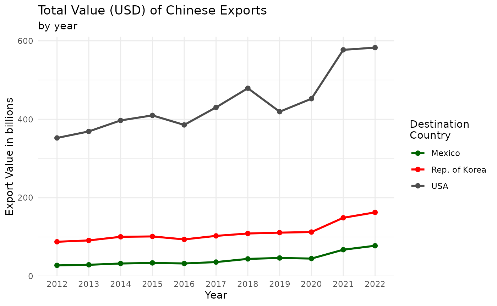
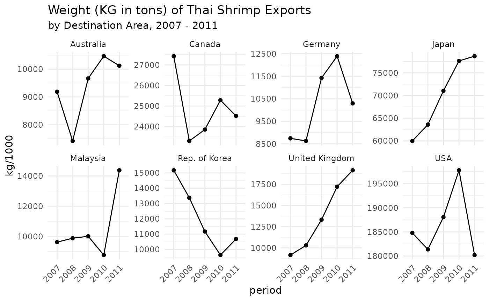

# comtradr

## Data availability

See [here for an
overview](https://uncomtrade.org/docs/why-are-some-converted-datasets-not-accessible-in-the-ui/)
of available commodity classifications.

## Package information

API wrapper for the [UN Comtrade
Database](https://comtradeplus.un.org/). UN Comtrade provides historical
data on the weights and value of specific goods shipped between
countries, more info can be found
[here](https://uncomtrade.org/docs/welcome-to-un-comtrade/). Full API
documentation can be found [here](https://comtradedeveloper.un.org/).

## Install and load comtradr

Install the development version from GitHub:

``` r

install.packages("comtradr")
```

Load comtradr

``` r

library(comtradr)
```

## Authentication 🔐

**Do not be discouraged by the complicated access to the token - you can
do it! 💪**

As stated above, you need an API token, see the FAQ of Comtrade for
details on how to obtain it:

➡️ <https://uncomtrade.org/docs/api-subscription-keys/>

You need to follow the detailed explanations, which include screenshots,
in the Wiki of Comtrade to the letter. ☝️ I am not writing them out
here, because they might be updated regularly. However, once you are
signed up, select the `comtrade - v1` product, which is the free API.

### Storing the API key

If you are in an interactive session, you can call the following
function to save your API token to the environment file for the current
session.

``` r

library(comtradr)

set_primary_comtrade_key()
```

If you are not in an interactive session, you can register the token
once in your session using the following base-r function.

``` r

Sys.setenv('COMTRADE_PRIMARY' = 'xxxxxxxxxxxxxxxxx')
```

If you would like to set the comtrade key permanently, we recommend
editing the project `.Renviron` file, where you need to add a line with
`COMTRADE_PRIMARY = xxxx-your-key-xxxx`.

ℹ️ Do not forget the line break after the last entry. This is the
easiest by taking advantage of the great `usethis` package.

``` r

usethis::edit_r_environ(scope = 'project')
```

## Making API calls

Lets say we want to get data on the total imports into the United States
from Germany, France, Japan, and Mexico, for the last five years.

``` r

example_1 <- ct_get_data(
  reporter = 'USA',
  partner = c('DEU', 'FRA','JPN','MEX'),
  commodity_code = 'TOTAL',
  start_date = 2018,
  end_date = 2023,
  flow_direction = 'import'
)
```

API calls return a tidy data frame.

``` r

str(example_1)
#> 'data.frame':    20 obs. of  47 variables:
#>  $ type_code                 : chr  "C" "C" "C" "C" ...
#>  $ freq_code                 : chr  "A" "A" "A" "A" ...
#>  $ ref_period_id             : int  20180101 20180101 20180101 20180101 20190101 20190101 20190101 20190101 20200101 20200101 ...
#>  $ ref_year                  : int  2018 2018 2018 2018 2019 2019 2019 2019 2020 2020 ...
#>  $ ref_month                 : int  52 52 52 52 52 52 52 52 52 52 ...
#>  $ period                    : chr  "2018" "2018" "2018" "2018" ...
#>  $ reporter_code             : int  842 842 842 842 842 842 842 842 842 842 ...
#>  $ reporter_iso              : chr  "USA" "USA" "USA" "USA" ...
#>  $ reporter_desc             : chr  "USA" "USA" "USA" "USA" ...
#>  $ flow_code                 : chr  "M" "M" "M" "M" ...
#>  $ flow_desc                 : chr  "Import" "Import" "Import" "Import" ...
#>  $ partner_code              : int  251 276 392 484 251 276 392 484 251 276 ...
#>  $ partner_iso               : chr  "FRA" "DEU" "JPN" "MEX" ...
#>  $ partner_desc              : chr  "France" "Germany" "Japan" "Mexico" ...
#>  $ partner2code              : int  0 0 0 0 0 0 0 0 0 0 ...
#>  $ partner2iso               : chr  "W00" "W00" "W00" "W00" ...
#>  $ partner2desc              : chr  "World" "World" "World" "World" ...
#>  $ classification_code       : chr  "H5" "H5" "H5" "H5" ...
#>  $ classification_search_code: chr  "HS" "HS" "HS" "HS" ...
#>  $ is_original_classification: logi  TRUE TRUE TRUE TRUE TRUE TRUE ...
#>  $ cmd_code                  : chr  "TOTAL" "TOTAL" "TOTAL" "TOTAL" ...
#>  $ cmd_desc                  : chr  "All Commodities" "All Commodities" "All Commodities" "All Commodities" ...
#>  $ aggr_level                : int  0 0 0 0 0 0 0 0 0 0 ...
#>  $ is_leaf                   : logi  FALSE FALSE FALSE FALSE FALSE FALSE ...
#>  $ customs_code              : chr  "C00" "C00" "C00" "C00" ...
#>  $ customs_desc              : chr  "TOTAL CPC" "TOTAL CPC" "TOTAL CPC" "TOTAL CPC" ...
#>  $ mos_code                  : chr  "0" "0" "0" "0" ...
#>  $ mot_code                  : int  0 0 0 0 0 0 0 0 0 0 ...
#>  $ mot_desc                  : chr  "TOTAL MOT" "TOTAL MOT" "TOTAL MOT" "TOTAL MOT" ...
#>  $ qty_unit_code             : int  -1 -1 -1 -1 -1 -1 -1 -1 -1 -1 ...
#>  $ qty_unit_abbr             : chr  "N/A" "N/A" "N/A" "N/A" ...
#>  $ qty                       : num  0 0 0 0 0 0 0 0 0 0 ...
#>  $ is_qty_estimated          : logi  FALSE FALSE FALSE FALSE FALSE FALSE ...
#>  $ alt_qty_unit_code         : int  -1 -1 -1 -1 -1 -1 -1 -1 -1 -1 ...
#>  $ alt_qty_unit_abbr         : chr  "N/A" "N/A" "N/A" "N/A" ...
#>  $ alt_qty                   : num  0 0 0 0 0 0 0 0 0 0 ...
#>  $ is_alt_qty_estimated      : logi  FALSE FALSE FALSE FALSE FALSE FALSE ...
#>  $ net_wgt                   : num  0 0 0 0 0 0 0 0 0 0 ...
#>  $ is_net_wgt_estimated      : logi  TRUE TRUE TRUE TRUE TRUE TRUE ...
#>  $ gross_wgt                 : num  0 0 0 0 0 0 0 0 0 0 ...
#>  $ is_gross_wgt_estimated    : logi  FALSE FALSE FALSE FALSE FALSE FALSE ...
#>  $ cifvalue                  : num  5.36e+10 1.28e+11 1.46e+11 3.49e+11 5.85e+10 ...
#>  $ fobvalue                  : num  0.00 0.00 0.00 0.00 5.75e+10 ...
#>  $ primary_value             : num  5.36e+10 1.28e+11 1.46e+11 3.49e+11 5.85e+10 ...
#>  $ legacy_estimation_flag    : int  4 4 4 4 4 4 4 4 4 4 ...
#>  $ is_reported               : logi  FALSE FALSE FALSE FALSE FALSE FALSE ...
#>  $ is_aggregate              : logi  TRUE TRUE TRUE TRUE TRUE TRUE ...
#>  - attr(*, "url")= chr "https://comtradeapi.un.org/data/v1/get/C/A/HS?cmdCode=TOTAL&flowCode=M&partnerCode=280%2C251%2C276%2C392%2C250%"| __truncated__
#>  - attr(*, "time")= POSIXct[1:1], format: "2023-06-27 22:26:56"
```

Here are a few more examples to show the different parameter options:

By default, the return data is in yearly amounts. We can pass
`"monthly"` to arg `freq` to return data in monthly amounts, however the
API limits each “monthly” query to a single year.

``` r

# all monthly data for a single year (API max of 12 months per call).
q <- ct_get_data(reporters = "USA",
               partners = c("Germany", "France", "Japan", "Mexico"),
               flow_direction = "import",
               start_date = 2012,
               end_date = 2012,
               freq = "monthly")

# monthly data for specific span of months (API max of twelve months per call).
q <- ct_get_data(reporters = "USA",
               partners = c("Germany", "France", "Japan", "Mexico"),
               flow_direction = "import",
               start_date = "2012-03",
               end_date = "2012-07",
               freq = "monthly")
```

Countries passed to parameters `reporters` and `partners` must be
spelled as they appear in the official ISO 3 character code convention.

Search trade related to specific commodities (say, tomatoes). We can
query the Comtrade commodity reference table to see all of the different
commodity descriptions available for tomatoes.

``` r

ct_commodity_lookup("tomato")
#> $tomato
#> [1] "0702 - Tomatoes; fresh or chilled"                                                                                                         
#> [2] "070200 - Vegetables; tomatoes, fresh or chilled"                                                                                           
#> [3] "2002 - Tomatoes; prepared or preserved otherwise than by vinegar or acetic acid"                                                           
#> [4] "200210 - Vegetable preparations; tomatoes, whole or in pieces, prepared or preserved otherwise than by vinegar or acetic acid"             
#> [5] "200290 - Vegetable preparations; tomatoes, (other than whole or in pieces), prepared or preserved otherwise than by vinegar or acetic acid"
#> [6] "200950 - Juice; tomato, unfermented, not containing added spirit, whether or not containing added sugar or other sweetening matter"        
#> [7] "210320 - Sauces; tomato ketchup and other tomato sauces"
```

If we want to search for shipment data on all of the commodity
descriptions listed, then we can simply adjust the parameters for
`ct_commodity_lookup` so that it will return only the codes, which can
then be passed along to `ct_search`.

``` r

tomato_codes <- ct_commodity_lookup("tomato",
                                    return_code = TRUE,
                                    return_char = TRUE)

q <- ct_get_data(
  reporter = 'USA',
  partner = c('DEU', 'FRA','JPN','MEX'),
  commodity_code = tomato_codes,
  start_date = "2012",
  end_date = "2013",
  flow_direction = 'import'
)
```

On the other hand, if we wanted to exclude juices and sauces from our
search, we can pass a vector of the relevant codes to the API call.

``` r

q <- ct_get_data(
  reporter = 'USA',
  partner = c('DEU', 'FRA','JPN','MEX'),
  commodity_code  = c("0702", "070200", "2002", "200210", "200290"),
  start_date = "2012",
  end_date = "2013",
  flow_direction = 'import'
)
               
```

## API search metadata

In addition to the trade data, each API return object contains metadata
as attributes.

``` r

# The url of the API call.
attributes(q)$url
#> NULL
# The date-time of the API call.
attributes(q)$time
#> NULL
```

## More on the lookup functions

Functions `ct_commodity_lookup` is able to take multiple search terms as
input.

``` r

ct_commodity_lookup(c("tomato", "trout"), return_char = TRUE)
#>  [1] "0702 - Tomatoes; fresh or chilled"                                                                                                                                                                                                                                     
#>  [2] "070200 - Vegetables; tomatoes, fresh or chilled"                                                                                                                                                                                                                       
#>  [3] "2002 - Tomatoes; prepared or preserved otherwise than by vinegar or acetic acid"                                                                                                                                                                                       
#>  [4] "200210 - Vegetable preparations; tomatoes, whole or in pieces, prepared or preserved otherwise than by vinegar or acetic acid"                                                                                                                                         
#>  [5] "200290 - Vegetable preparations; tomatoes, (other than whole or in pieces), prepared or preserved otherwise than by vinegar or acetic acid"                                                                                                                            
#>  [6] "200950 - Juice; tomato, unfermented, not containing added spirit, whether or not containing added sugar or other sweetening matter"                                                                                                                                    
#>  [7] "210320 - Sauces; tomato ketchup and other tomato sauces"                                                                                                                                                                                                               
#>  [8] "030191 - Fish; live, trout (Salmo trutta, Oncorhynchus mykiss, Oncorhynchus clarki, Oncorhynchus aguabonita, Oncorhynchus gilae, Oncorhynchus apache and Oncorhynchus chrysogaster)"                                                                                   
#>  [9] "030211 - Fish; fresh or chilled, trout (Salmo trutta, Oncorhynchus mykiss, Oncorhynchus clarki, Oncorhynchus aguabonita, Oncorhynchus gilae, Oncorhynchus apache and Oncorhynchus chrysogaster), excluding fillets, fish meat of 0304, and edible fish offal of 0302.9"
#> [10] "030314 - Fish; frozen, trout (Salmo trutta, Oncorhynchus mykiss, Oncorhynchus clarki, Oncorhynchus aguabonita, Oncorhynchus gilae, Oncorhynchus apache and Oncorhynchus chrysogaster), excluding fillets, meat of 0304, and edible fish offal of 0303.91 to 0303.99"   
#> [11] "030321 - --  Trout (Salmo trutta, Oncorhynchus mykiss, Oncorhynchus clarki, Oncorhynchus aguabonita, Oncorhynchus gilae, Oncorhynchus apache and Oncorhynchus chrysogaster)"                                                                                           
#> [12] "030442 - Fish fillets; fresh or chilled, trout (Salmo trutta, Oncorhynchus mykiss, Oncorhynchus clarki, Oncorhynchus aguabonita, Oncorhynchus gilae, Oncorhynchus apache and Oncorhynchus chrysogaster)"                                                               
#> [13] "030482 - Fish fillets; frozen, trout (Salmo trutta, Oncorhynchus mykiss, Oncorhynchus clarki, Oncorhynchus aguabonita, Oncorhynchus gilae, Oncorhynchus apache and Oncorhynchus chrysogaster)"                                                                         
#> [14] "030543 - Fish; smoked, whether or not cooked before or during smoking, trout (Salmo trutta, Oncorhynchus mykiss/clarki/aguabonita/gilae/apache/chrysogaster), includes fillets, but excludes edible fish offal"
```

`ct_commodity_lookup` can return a vector (as seen above) or a named
list, using parameter `return_char`

``` r

ct_commodity_lookup(c("tomato", "trout"), return_char = FALSE)
#> $tomato
#> [1] "0702 - Tomatoes; fresh or chilled"                                                                                                         
#> [2] "070200 - Vegetables; tomatoes, fresh or chilled"                                                                                           
#> [3] "2002 - Tomatoes; prepared or preserved otherwise than by vinegar or acetic acid"                                                           
#> [4] "200210 - Vegetable preparations; tomatoes, whole or in pieces, prepared or preserved otherwise than by vinegar or acetic acid"             
#> [5] "200290 - Vegetable preparations; tomatoes, (other than whole or in pieces), prepared or preserved otherwise than by vinegar or acetic acid"
#> [6] "200950 - Juice; tomato, unfermented, not containing added spirit, whether or not containing added sugar or other sweetening matter"        
#> [7] "210320 - Sauces; tomato ketchup and other tomato sauces"                                                                                   
#> 
#> $trout
#> [1] "030191 - Fish; live, trout (Salmo trutta, Oncorhynchus mykiss, Oncorhynchus clarki, Oncorhynchus aguabonita, Oncorhynchus gilae, Oncorhynchus apache and Oncorhynchus chrysogaster)"                                                                                   
#> [2] "030211 - Fish; fresh or chilled, trout (Salmo trutta, Oncorhynchus mykiss, Oncorhynchus clarki, Oncorhynchus aguabonita, Oncorhynchus gilae, Oncorhynchus apache and Oncorhynchus chrysogaster), excluding fillets, fish meat of 0304, and edible fish offal of 0302.9"
#> [3] "030314 - Fish; frozen, trout (Salmo trutta, Oncorhynchus mykiss, Oncorhynchus clarki, Oncorhynchus aguabonita, Oncorhynchus gilae, Oncorhynchus apache and Oncorhynchus chrysogaster), excluding fillets, meat of 0304, and edible fish offal of 0303.91 to 0303.99"   
#> [4] "030321 - --  Trout (Salmo trutta, Oncorhynchus mykiss, Oncorhynchus clarki, Oncorhynchus aguabonita, Oncorhynchus gilae, Oncorhynchus apache and Oncorhynchus chrysogaster)"                                                                                           
#> [5] "030442 - Fish fillets; fresh or chilled, trout (Salmo trutta, Oncorhynchus mykiss, Oncorhynchus clarki, Oncorhynchus aguabonita, Oncorhynchus gilae, Oncorhynchus apache and Oncorhynchus chrysogaster)"                                                               
#> [6] "030482 - Fish fillets; frozen, trout (Salmo trutta, Oncorhynchus mykiss, Oncorhynchus clarki, Oncorhynchus aguabonita, Oncorhynchus gilae, Oncorhynchus apache and Oncorhynchus chrysogaster)"                                                                         
#> [7] "030543 - Fish; smoked, whether or not cooked before or during smoking, trout (Salmo trutta, Oncorhynchus mykiss/clarki/aguabonita/gilae/apache/chrysogaster), includes fillets, but excludes edible fish offal"
```

For `ct_commodity_lookup`, if any of the input search terms return zero
results and parameter `verbose` is set to `TRUE`, a warning will be
printed to console (set `verbose` to `FALSE` to turn off this feature).

``` r

ct_commodity_lookup(c("tomato", "sldfkjkfdsklsd"), verbose = TRUE)
#> Warning: There were no matching results found for inputs: sldfkjkfdsklsd
#> $tomato
#> [1] "0702 - Tomatoes; fresh or chilled"                                                                                                         
#> [2] "070200 - Vegetables; tomatoes, fresh or chilled"                                                                                           
#> [3] "2002 - Tomatoes; prepared or preserved otherwise than by vinegar or acetic acid"                                                           
#> [4] "200210 - Vegetable preparations; tomatoes, whole or in pieces, prepared or preserved otherwise than by vinegar or acetic acid"             
#> [5] "200290 - Vegetable preparations; tomatoes, (other than whole or in pieces), prepared or preserved otherwise than by vinegar or acetic acid"
#> [6] "200950 - Juice; tomato, unfermented, not containing added spirit, whether or not containing added sugar or other sweetening matter"        
#> [7] "210320 - Sauces; tomato ketchup and other tomato sauces"                                                                                   
#> 
#> $sldfkjkfdsklsd
#> character(0)
```

## API rate limits

The Comtrade API imposes rate limits on users. `comtradr` features
automated throttling of API calls to ensure the user stays within the
limits defined by Comtrade. Below is a breakdown of those limits, API
docs on these details can be found
[here](https://uncomtrade.org/docs/subscriptions/).

- Without user token: unlimited calls/day, up to 500 records per call
  (registration and API subscription key not required) – this end-point
  is not implemented here.
- With valid user token: 500 calls/day, up to 100,000 records per call
  (free registration and API subscription key required).

The API also limits the amount of times it can be queried per minute,
but we could not find documentation on this. Hence the function
automatically responds to the parameters returned by each request to
adjust to the changing wait times.

In addition to these rate limits, the API imposes some limits on
parameter combinations.

- The arguments `reporters`, `partners` do not have an `All` value
  specified natively anymore, we have implemented it in R for
  convenience reasons on our side.
- For date range the `start_date` and `end_date` must not span more than
  twelve months or twelve years. There is no more parameter to specify
  `All` years.
- For arg `commodity_codes`, the maximum number of input values is
  dependent on the maximum length of the request. Hence, if specifying
  `reporters` or `partners`, this value might be shorter.

## Package Data

`comtradr` ships with a few different package data objects, and
functions for interacting with and using the package data.

**Country/Commodity Reference Tables**

As explained previously, making API calls with `comtradr` often requires
the user to query the commodity reference table (this is done using
functions `ct_commodity_lookup`). These reference tables are generated
by the UN Comtrade, and are updated roughly once a year. Since they’re
updated infrequently, the tables are saved as cached data objects within
the `comtradr` package, and are referenced by the package functions when
needed.

The function features an `update` argument, that checks for updates,
downloads the new tables if necessary and makes them available during
the current R session. It will also print a message indicating whether
updates were found, like so:

``` r

ct_commodity_lookup('tomato',update = T)
```

If any updates are found, the message will state which reference
table(s) were updated.

Additionally, the Comtrade API features a number of different commodity
reference tables, based on different trade data classification schemes
(for more details, see
[this](https://uncomtrade.org/docs/list-of-references-parameter-codes/)
page from the API docs). `comtradr` ships with all available commodity
reference tables. The user may return and access any of the available
commodity tables by specifying arg `commodity_type` within function
`ct_get_ref_table` (e.g., `ct_get_ref_table(dataset_id = "S1")` will
return the commodity table that follows the “S1” scheme).

The `dataset_id`´s are listed in the help page of the function
[`ct_get_ref_table()`](https://docs.ropensci.org/comtradr/reference/ct_get_ref_table.md).
They are as follows:

- Datasets that contain codes for the `commodity_code` argument. The
  name is the same as you would provide under
  `commodity_classification`.
- ‘HS’ This is probably the most common classification for goods.
- ‘B4’
- ‘B5’
- ‘EB02’
- ‘EB10’
- ‘EB10S’
- ‘EB’
- ‘S1’
- ‘S2’
- ‘S3’
- ‘S4’
- ‘SS’
- Datasets that are related to other arguments, can be queried directly
  with the name of the argument in the
  [`ct_get_data()`](https://docs.ropensci.org/comtradr/reference/ct_get_data.md)-function.
- ‘reporter’
- ‘partner’
- ‘mode_of_transport’
- ‘customs_code’

Furthermore, there is a dataset readily available, with the iso3c-codes
for the respective partner and reporter countries `country_codes$iso_3`,
but I would recommend using the
[`ct_get_ref_table()`](https://docs.ropensci.org/comtradr/reference/ct_get_ref_table.md)
function, as it allows to update to the latest values on the fly.

## Visualize

Once the data is collected, we can use it to create some basic
visualizations.

**Plot 1**: Plot total value (USD) of Chinese exports to Mexico, South
Korea and the United States, by year.

``` r

# Comtrade api query.
example_2 <- ct_get_data(
  reporter = 'CHN',
  partner = c('KOR', 'USA','MEX'),
  commodity_code = 'TOTAL',
  start_date = 2012,
  end_date = 2023,
  flow_direction = 'export'
)
```

``` r

library(ggplot2)

# Apply polished col headers.
# Create plot.
ggplot(example_2, aes(period, primary_value/1000000000, color = partner_desc, 
                      group = partner_desc)) +
  geom_point(size = 2) +
  geom_line(size = 1) +
  scale_color_manual( values = c("darkgreen","red","grey30"),
                      name = "Destination\nCountry") +
  ylab('Export Value in billions') +
  xlab('Year') +
  labs(title = "Total Value (USD) of Chinese Exports", subtitle = 'by year') +
  theme(axis.text.x = element_text(angle = 45, vjust = 1, hjust = 1)) +
  theme_minimal()
```



**Plot 2**: Plot the top eight destination countries/areas of Thai
shrimp exports, by weight (KG), for 2007 - 2011.

``` r

# First, collect commodity codes related to shrimp.
shrimp_codes <- ct_commodity_lookup("shrimp",
                                    return_code = TRUE,
                                    return_char = TRUE)

# Comtrade api query.
example_3 <- ct_get_data(reporter = "THA",
                partner = "all",
                trade_direction = "exports",
                start_date = 2007,
                end_date = 2011,
                commodity_code = shrimp_codes)
```

``` r

library(ggplot2)
library(dplyr)


# Create country specific "total weight per year" dataframe for plotting.
plotdf <- example_3 %>%
  group_by(partner_desc, period) %>%
  summarise(kg = as.numeric(sum(net_wgt, na.rm = TRUE))) 

# Get vector of the top 8 destination countries/areas by total weight shipped
# across all years, then subset plotdf to only include observations related
# to those countries/areas.
top8 <- plotdf |> 
  group_by(partner_desc) |> 
  summarise(kg = as.numeric(sum(kg, na.rm = TRUE))) |> 
  slice_max(n = 8, order_by = kg) |> 
  arrange(desc(kg)) |> 
  pull(partner_desc)
plotdf <- plotdf %>% filter(partner_desc %in% top8)

# Create plots (y-axis is NOT fixed across panels, this will allow us to ID
# trends over time within each country/area individually).
ggplot(plotdf,aes(period,kg/1000, group = partner_desc))+
  geom_line() + 
  geom_point() + 
  facet_wrap(.~partner_desc, nrow = 2, ncol = 4,scales = 'free_y')+
  labs(title = "Weight (KG in tons) of Thai Shrimp Exports", 
       subtitle ="by Destination Area, 2007 - 2011")+
  theme_minimal()+
  theme(axis.text.x = element_text(angle = 45,hjust = 1, vjust = 1))
```



## Handling large amounts of Parameters

In the `comtradr` package, several function parameters can accept
`everything` as a valid input. Using `everything` for these parameters
has specific meanings and can be a powerful tool for querying data.
Internally, these values are set to `NULL` and the parameter is omitted
entirely in the request to the API, the API then by default returns all
possible values. Here’s a breakdown of how `everything` is handled for
different parameters:

### `commodity_code`

Setting `commodity_code` to `everything` will query all possible
commodity values. This can be useful if you want to retrieve data for
all commodities without specifying individual codes.

### `flow_direction`

If `flow_direction` is set to `everything`, all possible values for
trade flow directions are queried. This includes imports, exports,
re-imports, re-exports and some more specified in
`ct_get_ref_table('flow_direction')`.

### `reporter` and `partner`

Using `everything` for `reporter` or `partner` will query all possible
values for reporter and partner countries, but also includes aggregates
like `World` or some miscellaneous like `ASEAN`. Be careful when
aggregating these values, so as to not count trade values multiple times
in different aggregates. Alternatively, specifically for these values,
you can also use `all_countries`, which allows you to query all
countries which are not aggregates of some kind of grouped parameters
like `ASEAN`. These values can usually be safely aggregated. This allows
you to retrieve trade data for all countries without specifying
individual ISO3 codes.

### `mode_of_transport`, `partner_2`, and `customs_code`

Setting these parameters to `everything` will query all possible values
related to the mode of transport, secondary partner, and customs
procedures. This provides a comprehensive view of the data across
different transportation modes and customs categories.

### Example Usage

Here’s an example of how you might use `everything` parameters to query
comprehensive data:

``` r

# Querying all commodities and flow directions for USA and Germany from 
## 2010 to 2011
data <- ct_get_data(
  reporter = c('USA', 'DEU'),
  commodity_code = 'everything',
  flow_direction = 'everything',
  start_date = '2010',
  end_date = '2011'
)
```

Using `everything` parameters can lead to large datasets, as they often
remove specific filters on the data. It’s essential to be mindful of the
size of the data being queried, especially when using multiple
`everything` parameters simultaneously.
