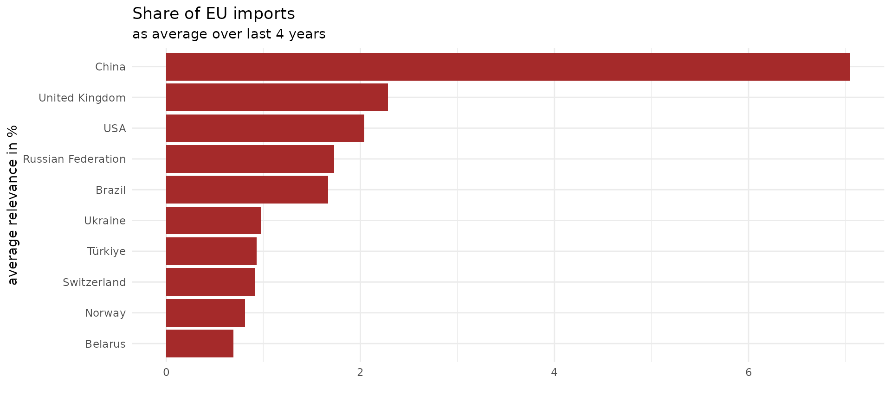

# Querying large amounts of data

``` r

library(comtradr)
library(dplyr)
library(ggplot2)
```

### The limits

When you are on the free API tier, you will encounter two limits when
wanting to calculate on rather large datasets:

1.  you can only make 500 calls per day,

2.  of which each can take up to 100.000 rows.

This information might be updated in the Comtrade API, check the most up
to date values [here](https://uncomtrade.org/docs/subscriptions/).

So when trying to fetch the maximum amount of data in the minimum amount
of days, you want to minimize the amount of requests you need by making
them as comprehensive as possible, without ever exceeding the 100k row
limit.

### The example - Imports of the EU

Let’s say, we want to know which is the top exporter of the EU in each
product class of the Harmonic System. This could be useful, when
thinking about dependencies between countries, e.g. when evaluating the
usefulness or impact of Regulation such as the [EUDR
Regulation](https://environment.ec.europa.eu/topics/forests/deforestation/regulation-deforestation-free-products_en).
Quoting from the
[ITC](https://tradebriefs.intracen.org/2023/11/spotlight): “Under the
regulation that entered into force on 29 June 2023, any operator or
trader placing \[specific\] commodities on the EU market or exporting
them from the EU, has to be able to prove that the goods do not
originate from deforested land (cutoff date 31 December 2020) or
contribute to forest degradation”. One question that arises would be,
what are the impacts of this regulation on other countries and which of
these is particularly important to the EU?

Let’s replicate some of their numbers, e.g. the relevance to the EU
indicator from the map of the ITC spotlight cited above.

*What is the share of one country in the EU’s imports of a product?*

Remember, to get Comtrade data, we need the Commodity Codes, the
respective iso3 codes for the countries and a time frame.

#### 1. What are the commodity codes?

First we need to find out, which HS codes, or which goods are affected.
We look at Annex 1 of the
[Regulation](https://eur-lex.europa.eu/legal-content/EN/TXT/?uri=CELEX%3A32023R1115&qid=1687867231461).
This gives us more or less the following list of commodities for the
product class ‘Wood’.

``` r

wood <-
  c(
    "4401",
    "4402",
    "4403",
    "4404",
    "4405",
    "4406",
    "4407",
    "4408",
    "4409",
    "4410",
    "4411",
    "4412",
    "4413",
    "4414",
    "4415",
    "4416",
    "4417",
    "4418",
    "4419",
    "4420",
    "4421",
    "940330",
    "940340",
    "940350",
    "940360",
    "940391",
    "940610",
    "4701",
    "4702",
    "4703",
    "4704",
    "4705",
    "470610", 
    "470691", 
    "470692", 
    "470693",
    "48",
    "49",
    "9401"
  )
wood_df <- data.frame(cmd_code = wood, product_cat = "wood")
```

#### 2. Which are the countries?

First we need a list of the EU27 countries as iso3 codes. I use the
`giscoR` package to get this information quickly.

``` r

eu_countries <- giscoR::gisco_countrycode |> 
  filter(eu == T) |> 
  pull(ISO3_CODE)
```

Secondly, we need a vector for all other countries, but we can get this
easily by just specifying `all_countries` in the parameter to the
partner argument.

### Getting the data

To calculate the relevance of a product category to the EU, we need to
calculate the following:

$`\text{Import Relevance to EU in %} = \frac{\sum_{c \in \text{EU27}} I_{c,p}}{\sum_{c \in \text{EU27}} W_{c,p}}`$

Where:

- $`I_{c,p}`$: Imports of EU country c in product category $`p`$ from a
  specific non-EU country.
- $`W_{c,p}`$: Total imports of EU country $`c`$ in product category
  $`p`$ from the world.

In plain English, we need to know how much of a given product comes from
one country and which share of the total imports it has.

Let’s get $`I_{c,p}`$ first.

#### EU imports from all countries

If you were to execute this query, you will get a return object that
contains exactly 100k rows and a warning, that if you did not intend to
get exactly 100k rows, you have most likely hit the limit.

This seems natural in this case, as we are trying to get data on about
39 commodity classes for 27 EU countries as reporters and about 190
partners in 4 years. This equals to potentially 800k rows.

``` r

data_eu_imports <- ct_get_data(
    commodity_code = wood,
    reporter = eu_countries,
    partner = "all_countries",
    flow_direction = "import",
    start_date = 2018,
    end_date = 2022
  ) 
```

Let’s break this down into a simple loop. We could iterate over years,
but that would only get us down to about 200k rows for each year. Since
we have 250 calls per day, let’s just iterate over each eu country and
get the data separately.

``` r

## initiate a new instance of an empty tibble()
data_eu_imports <- data.frame()

for(reporter in eu_countries){
  ## for a simple status, print the country we are at 
  ## you can get a lot fancier with the library `progress` for progress bars
  print(reporter)
  
  ## assign the result into a temporary object
  temp <- ct_get_data(
    commodity_code = wood,
    reporter = reporter,
    partner = "all_countries",
    flow_direction = "import",
    start_date = 2018,
    end_date = 2022
  ) 
  
  ## bind the subset to the complete data
  data_eu_imports <- rbind(data_eu_imports, temp)
  
  ## note that I did not include any sleep() command here to make the requests
  ## wait for a specified amount of time, the package keeps track of that for 
  ## you automatically and backs off when needed
}
```

``` r

nrow(data_eu_imports)
#> [1] 173358
```

Congratulations, you have now queried 170k rows of data, exceeding the
limit of one call to the API!

Getting the data for imports from the World, $`W_{c,p}`$, should be easy
now!

``` r

data_eu_imports_world <- ct_get_data(
    commodity_code = wood,
    reporter = eu_countries,
    partner = "World",
    flow_direction = "import",
    start_date = 2018,
    end_date = 2022
  )
```

``` r

nrow(data_eu_imports_world)
#> [1] 5004
```

#### Data cleaning

    #> `summarise()` has regrouped the output.
    #> ℹ Summaries were computed grouped by partner_iso, partner_desc, flow_desc,
    #>   product_cat, and ref_year.
    #> ℹ Output is grouped by partner_iso, partner_desc, flow_desc, and product_cat.
    #> ℹ Use `summarise(.groups = "drop_last")` to silence this message.
    #> ℹ Use `summarise(.by = c(partner_iso, partner_desc, flow_desc, product_cat,
    #>   ref_year))` for per-operation grouping (`?dplyr::dplyr_by`) instead.

``` r

data_eu_imports_world_clean <- data_eu_imports_world |>
  left_join(wood_df, by = "cmd_code") |>
  select(
    reporter_iso,
    reporter_desc,
    flow_desc,
    partner_iso,
    partner_desc,
    cmd_code,
    cmd_desc,
    product_cat,
    primary_value,
    ref_year
  ) |>
    ## we now aggregate the imports by the product category and year 
    ## over all reporters, since we are interested 
    ## in the imports of the whole EU
  group_by(product_cat, ref_year) |>
  summarise(eu_import_product_cat_world = sum(primary_value)) |>
  ungroup()
#> `summarise()` has regrouped the output.
#> ℹ Summaries were computed grouped by product_cat and ref_year.
#> ℹ Output is grouped by product_cat.
#> ℹ Use `summarise(.groups = "drop_last")` to silence this message.
#> ℹ Use `summarise(.by = c(product_cat, ref_year))` for per-operation grouping
#>   (`?dplyr::dplyr_by`) instead.
```

``` r

#### relevance to EU
relevance <- data_eu_imports_clean |> 
  left_join(data_eu_imports_world_clean) |> 
  ## join the two datasets
  mutate(relevance_eu = eu_import_product_cat/
           eu_import_product_cat_world*100) |> 
  ## calculate the ratio between world imports and imports from one partner |> 
  select( -flow_desc) |> ungroup()  
#> Joining with `by = join_by(product_cat, ref_year)`
```

Let’s see who has the biggest share in the EU import market for wood
(excluding EU countries).

``` r

top_10 <- relevance |> 
  filter(!partner_iso %in% eu_countries) |> 
  group_by(ref_year) |> 
  slice_max(order_by = relevance_eu, n = 10) |> 
  select(partner_desc, relevance_eu, ref_year) |> 
  arrange(desc(ref_year))

head(top_10, 10)
#> # A tibble: 10 × 3
#> # Groups:   ref_year [1]
#>    partner_desc       relevance_eu ref_year
#>    <chr>                     <dbl>    <int>
#>  1 China                     7.77      2022
#>  2 USA                       2.03      2022
#>  3 Brazil                    1.96      2022
#>  4 United Kingdom            1.95      2022
#>  5 Türkiye                   1.19      2022
#>  6 Ukraine                   1.07      2022
#>  7 Russian Federation        0.971     2022
#>  8 Switzerland               0.876     2022
#>  9 Norway                    0.799     2022
#> 10 Indonesia                 0.656     2022
```

Let’s also do a little sanity check. When summing up all the shares over
one year, we should get to 100 %. This seems to hold.

``` r

relevance |> ungroup() |> 
  group_by(ref_year) |> 
  summarise(sum = sum(relevance_eu))
#> # A tibble: 5 × 2
#>   ref_year   sum
#>      <int> <dbl>
#> 1     2018 100. 
#> 2     2019 100. 
#> 3     2020 100. 
#> 4     2021 100.0
#> 5     2022 100.0
```

Maybe the last year was an outlier? We can calculate the mean relevante
a country had in the past 5 years and get the most important countries
again.

``` r

average_share <- relevance |> 
  filter(!partner_iso %in% eu_countries) |> 
  group_by(partner_iso, partner_desc) |>
  summarise(mean_relevance_eu = mean(relevance_eu)) |> 
  ungroup() |> 
  slice_max(order_by = mean_relevance_eu, n = 10)
#> `summarise()` has regrouped the output.
#> ℹ Summaries were computed grouped by partner_iso and partner_desc.
#> ℹ Output is grouped by partner_iso.
#> ℹ Use `summarise(.groups = "drop_last")` to silence this message.
#> ℹ Use `summarise(.by = c(partner_iso, partner_desc))` for per-operation
#>   grouping (`?dplyr::dplyr_by`) instead.
```

``` r

ggplot(average_share) +
  geom_col(aes(reorder(partner_desc,mean_relevance_eu), mean_relevance_eu), 
           fill = 'brown') +
  coord_flip() + 
  theme_minimal() +
  labs(title = 'Share of EU imports', 
       subtitle = 'as average over last 4 years') +
  xlab('average relevance in %')+
  ylab('')
```



### Caveat on trade “dependencies”

However, several important caveats are to be made. I have not addressed
these, because this vignette is about how to query larger data, not
about trade dependencies per se. Hence a real-world example, but without
all the complications that you would have to address for a valid
analysis.

1.  Dependency on a certain country in terms of how much of a product
    others import from them, does not equal dependency in terms of this
    product, as a country might have a substantial production of such
    items domestically. E.g. if (hypothetically) Argentina would import
    90% of its wine from Chile that would not imply that Argentina
    depends on wine from Chile, if Argentina themselves produce a
    substantive amount of wine.

2.  We included in our calculation of the total imports of the EU,
    imports from other EU countries, a.k.a. intra-EU imports. That would
    mean we probably underestimate how much of total EU imports really
    come from partner countries outside the EU.

3.  Some of the HS codes for wood are not completely to be included per
    the Regulation, but I have spared us the intricacies of which ones
    and how to exclude them here.

4.  Imports data is already better than exports data, because countries
    have an incentive to get good data to charge tariffs, however the
    best data for the EU comes from Eurostat, not Comtrade. But since
    this is about the Comtrade data, it will have to do.
